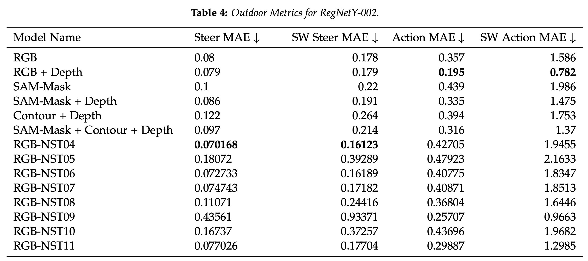

# A Style Transfer Approach To Appearance Agnostic Agents


## Overview
Sim2Real is a training-approach in Robotics where an agent is trained in simulation and deployed in real environments. In this paper, we investigate Neural Style Transfer as a domain randomization approach to Sim2Real.

## Contents
This repository contains the code for *A style Transfer Approach to Appearance Agnostic Agents*. To reproduce results, follow the following set of steps. **Update**: This project was implemented in the BU Shared Computing Cluster. The dataset (> 100GB) has been cleared to make more space for other lab members. Unfortunately, the data will have to be remade.

## Result Reproduction
### Setup
Unzip the two zip files for dataset creation scripts and training (and evaluation)  scripts
Clone the repo, setup CARLA 0.9.10.1, and build the conda environment as follows:
```
git clone https://github.com/vrsreeganesh/EC523_Project.git
conda env create -f environment.yml
conda activate tfuse
```

### Dataset 
The scripts named CreateNSTDataset*.py are the python scripts for creating NST versions of datasets at different style-weight and content-weight parameters. Run their corresponding bash scripts, named, Run_CreateNST_*.sh to create rgb version of the original dataset. The dataset cumulative has a size of 100GB, so please mail vrs@bu.edu for access to it, if you're a student at Harvard, MIT or BU. 

The dataset is structured as follows
```
- Scenario
    - Town
        - Route
            - rgb: camera images
            - label_raw: 3d bounding boxes for vehicles
            - measurements: contains ego-agent's position, velocity and other metadata
            - rgb_ColourFlippingOnly: rgb but where channels are randomly flipped
            - rgb_depths: rgb + depth, four channeled tensor
            - rgb_NST*: different directories corresponds to NST of different style and content weights
            - rgb_sam_contours: contours of RGB images obtained from SAM model
            - rgb_sam_masks: masks of RGB images obtained from SAM model
            - rgb_sam_masks_with_contours: rgb with masks and contours obtained from SAM
            - semantics: corresponding segmentation images
            - topdown: topdown segmentation maps
```

## Training
The code for training is given in the zip file, TrainingRelated. The python files named, "Train_baseline\*\_regnety\_\*" is the python training script for training different RegNetY networks for different levels of style transfer. Run the associated Shell script, train\*\_regnety\_\* to start training. Please make sure GPU is available as these training scripts are quite compute intensive. Training should take approximately an hour.

## Evaluation
The python training scipts are available as, "evaluate_offline\*\_regnety\_\*.py". Run the corresponding bash script to evaluate models, "offline_eval_\*\_regnety\_\*.sh". The script takes around 5 minutes to run and produces csv files documenting the different error metrics for different time steps. 

## Results





The results of our experiments are presented in Tables, 1, 2, 3, 4, 5, and 6. Tables 1, 2, and 3, shows the results of the three models when tested on the indoor dataset. Tables, 4, 5, and 6, shows the results of the three models when tested on the outdoor dataset.

We see that the NST methods are outperforming the other baselines a significant proportion of the time. RegNetY-002 with NST produced a decrease of 20% in Steer-MAE, 12% in Steer-SW-MAE, 16% in Action-MAE. RegNetY-004 with NST produced an decrease of 14% in Steer-MAE, 11% in Steer-SW-MAE, 7% in Action-MAE and 18% in Action-SW-MAE. This is promising because the NST methods do not add any stages to the existing pipelines whereas the others do. The methods based on SAM or depth-anything involve running RGB image through a large model, which significantly increases latency. This means that in order to reduce it, one would have to employ a substantial amount of additional compute resources to reduce latency. The NST method on the other hand only requires the compute during training, while also reducing the amount of human effort compared to other domain randomization methods.

Thus, NST is a best of both-worlds as it reduces human effort for domain randomization and increase performance, all without increasing latency.